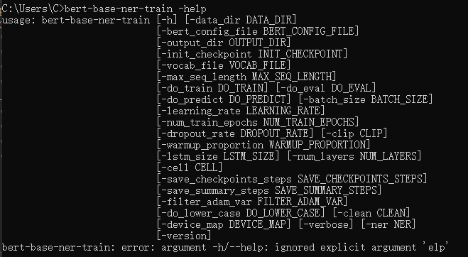
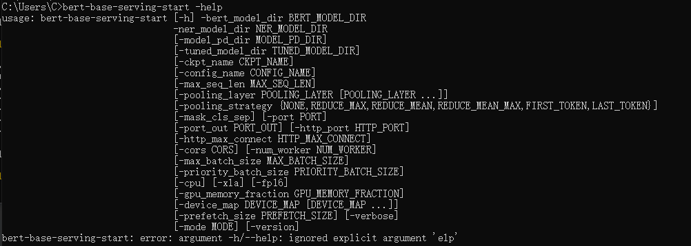
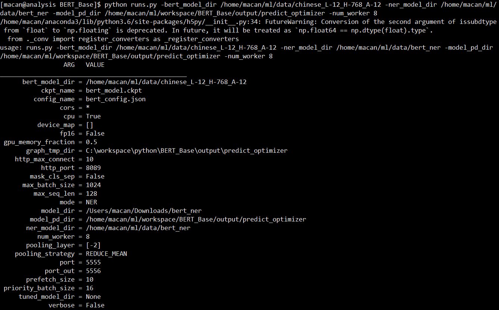
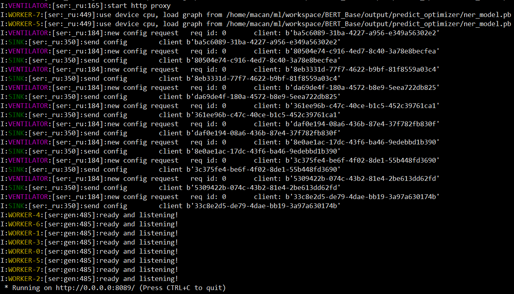
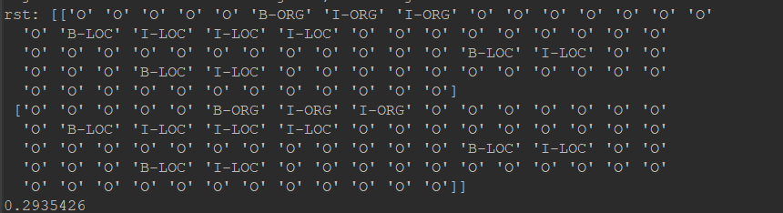
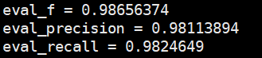
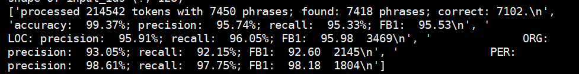
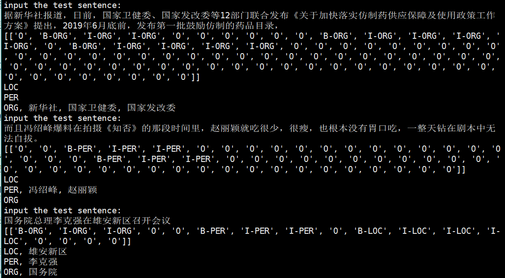

# BERT-BiLSTM-CRF-NER
Tensorflow solution of NER task Using BiLSTM-CRF model with Google BERT Fine-tuning

使用谷歌的BERT模型在BLSTM-CRF模型上进行预训练用于中文命名实体识别的Tensorflow代码'

中文文档请查看https://blog.csdn.net/macanv/article/details/85684284  如果对您有帮助，麻烦点个star,谢谢~~  

Welcome to star this repository!

The Chinese training data($PATH/NERdata/) come from:https://github.com/zjy-ucas/ChineseNER 
  
The CoNLL-2003 data($PATH/NERdata/ori/) come from:https://github.com/kyzhouhzau/BERT-NER 
  
The evaluation codes come from:https://github.com/guillaumegenthial/tf_metrics/blob/master/tf_metrics/__init__.py  


Try to implement NER work based on google's BERT code and BiLSTM-CRF network!
This project may be more close to process Chinese data. but other language only need Modify a small amount of code.

THIS PROJECT ONLY SUPPORT Python3.  
###################################################################
## Download project and install  
You can install this project by:  
```
pip install bert-base==0.0.9 -i https://pypi.python.org/simple
```

OR
```angular2html
git clone https://github.com/macanv/BERT-BiLSTM-CRF-NER
cd BERT-BiLSTM-CRF-NER/
python3 setup.py install
```

if you do not want to install, you just need clone this project and reference the file of <run.py> to train the model or start the service. 

## UPDATE:
- 2020.2.6 add simple flask ner service code
- 2019.2.25 Fix some bug for ner service
- 2019.2.19: add text classification service
-  fix Missing loss error
- add label_list params in train process, so you can using -label_list xxx to special labels in training process.  
  
    
## Train model:
You can use -help to view the relevant parameters of the training named entity recognition model, where data_dir, bert_config_file, output_dir, init_checkpoint, vocab_file must be specified.
```angular2html
bert-base-ner-train -help
```
  
  

train/dev/test dataset is like this:
```
海 O
钓 O
比 O
赛 O
地 O
点 O
在 O
厦 B-LOC
门 I-LOC
与 O
金 B-LOC
门 I-LOC
之 O
间 O
的 O
海 O
域 O
。 O
```
The first one of each line is a token, the second is token's label, and the line is divided by a blank line. The maximum length of each sentence is [max_seq_length] params.  
You can get training data from above two git repos  
You can training ner model by running below command:  
```angular2html
bert-base-ner-train \
    -data_dir {your dataset dir}\
    -output_dir {training output dir}\
    -init_checkpoint {Google BERT model dir}\
    -bert_config_file {bert_config.json under the Google BERT model dir} \
    -vocab_file {vocab.txt under the Google BERT model dir}
```
like my init_checkpoint: 
```
init_checkpoint = F:\chinese_L-12_H-768_A-12\bert_model.ckpt
```
you can special labels using -label_list params, the project get labels from training data.  
```angular2html
# using , split
-labels 'B-LOC, I-LOC ...'
OR save label in a file like labels.txt, one line one label
-labels labels.txt
```    

After training model, the NER model will be saved in {output_dir} which you special above cmd line.  
##### My Training environment：Tesla P40 24G mem  

## As Service
Many server and client code comes from excellent open source projects: [bert as service of hanxiao](https://github.com/hanxiao/bert-as-service) If my code violates any license agreement, please let me know and I will correct it the first time.
~~and NER server/client service code can be applied to other tasks with simple modifications, such as text categorization, which I will provide later.~~
this project private Named Entity Recognition and Text Classification server service.
Welcome to submit your request or share your model, if you want to share it on Github or my work.  

You can use -help to view the relevant parameters of the NER as Service:
which model_dir, bert_model_dir is need
```
bert-base-serving-start -help
```


and than you can using below cmd start ner service:
```angular2html
bert-base-serving-start \
    -model_dir C:\workspace\python\BERT_Base\output\ner2 \
    -bert_model_dir F:\chinese_L-12_H-768_A-12
    -model_pb_dir C:\workspace\python\BERT_Base\model_pb_dir
    -mode NER
```
or text classification service:
```angular2html
bert-base-serving-start \
    -model_dir C:\workspace\python\BERT_Base\output\ner2 \
    -bert_model_dir F:\chinese_L-12_H-768_A-12
    -model_pb_dir C:\workspace\python\BERT_Base\model_pb_dir
    -mode CLASS
    -max_seq_len 202
```

as you see:   
mode: If mode is NER/CLASS, then the service identified by the Named Entity Recognition/Text Classification will be started. If it is BERT, it will be the same as the [bert as service] project.  
bert_model_dir: bert_model_dir is a BERT model, you can download from https://github.com/google-research/bert
ner_model_dir: your ner model checkpoint dir
model_pb_dir: model freeze save dir, after run optimize func, there will contains like ner_model.pb binary file  
>You can download my ner model from：https://pan.baidu.com/s/1m9VcueQ5gF-TJc00sFD88w, ex_code: guqq
> Or text classification model from: https://pan.baidu.com/s/1oFPsOUh1n5AM2HjDIo2XCw, ex_code: bbu8   
Set ner_mode.pb/classification_model.pb to model_pb_dir, and set other file to model_dir(Different models need to be stored separately, you can set ner models label_list.pkl and label2id.pkl to model_dir/ner/ and set text classification file to model_dir/text_classification) , Text classification model can classify 12 categories of Chinese data： '游戏', '娱乐', '财经', '时政', '股票', '教育', '社会', '体育', '家居', '时尚', '房产', '彩票'  

You can see below service starting info:




you can using below code test client:  
#### 1. NER Client
```angular2html
import time
from bert_base.client import BertClient

with BertClient(show_server_config=False, check_version=False, check_length=False, mode='NER') as bc:
    start_t = time.perf_counter()
    str = '1月24日，新华社对外发布了中央对雄安新区的指导意见，洋洋洒洒1.2万多字，17次提到北京，4次提到天津，信息量很大，其实也回答了人们关心的很多问题。'
    rst = bc.encode([str, str])
    print('rst:', rst)
    print(time.perf_counter() - start_t)
```
you can see this after run the above code:

If you want to customize the word segmentation method, you only need to make the following simple changes on the client side code.

```angular2html
rst = bc.encode([list(str), list(str)], is_tokenized=True)
```  

#### 2. Text Classification Client
```angular2html
with BertClient(show_server_config=False, check_version=False, check_length=False, mode='CLASS') as bc:
    start_t = time.perf_counter()
    str1 = '北京时间2月17日凌晨，第69届柏林国际电影节公布主竞赛单元获奖名单，王景春、咏梅凭借王小帅执导的中国影片《地久天长》连夺最佳男女演员双银熊大奖，这是中国演员首次包揽柏林电影节最佳男女演员奖，为华语影片刷新纪录。与此同时，由青年导演王丽娜执导的影片《第一次的别离》也荣获了本届柏林电影节新生代单元国际评审团最佳影片，可以说，在经历数个获奖小年之后，中国电影在柏林影展再次迎来了高光时刻。'
    str2 = '受粤港澳大湾区规划纲要提振，港股周二高开，恒指开盘上涨近百点，涨幅0.33%，报28440.49点，相关概念股亦集体上涨，电子元件、新能源车、保险、基建概念多数上涨。粤泰股份、珠江实业、深天地A等10余股涨停；中兴通讯、丘钛科技、舜宇光学分别高开1.4%、4.3%、1.6%。比亚迪电子、比亚迪股份、光宇国际分别高开1.7%、1.2%、1%。越秀交通基建涨近2%，粤海投资、碧桂园等多股涨超1%。其他方面，日本软银集团股价上涨超0.4%，推动日经225和东证指数齐齐高开，但随后均回吐涨幅转跌东证指数跌0.2%，日经225指数跌0.11%，报21258.4点。受芯片制造商SK海力士股价下跌1.34％拖累，韩国综指下跌0.34％至2203.9点。澳大利亚ASX 200指数早盘上涨0.39％至6089.8点，大多数行业板块均现涨势。在保健品品牌澳佳宝下调下半财年的销售预期后，其股价暴跌超过23％。澳佳宝CEO亨弗里（Richard Henfrey）认为，公司下半年的利润可能会低于上半年，主要是受到销售额疲弱的影响。同时，亚市早盘澳洲联储公布了2月会议纪要，政策委员将继续谨慎评估经济增长前景，因前景充满不确定性的影响，稳定当前的利率水平比贸然调整利率更为合适，而且当前利率水平将有利于趋向通胀目标及改善就业，当前劳动力市场数据表现强势于其他经济数据。另一方面，经济增长前景亦令消费者消费意愿下滑，如果房价出现下滑，消费可能会进一步疲弱。在澳洲联储公布会议纪要后，澳元兑美元下跌近30点，报0.7120 。美元指数在昨日触及96.65附近的低点之后反弹至96.904。日元兑美元报110.56，接近上一交易日的低点。'
    str3 = '新京报快讯 据国家市场监管总局消息，针对媒体报道水饺等猪肉制品检出非洲猪瘟病毒核酸阳性问题，市场监管总局、农业农村部已要求企业立即追溯猪肉原料来源并对猪肉制品进行了处置。两部门已派出联合督查组调查核实相关情况，要求猪肉制品生产企业进一步加强对猪肉原料的管控，落实检验检疫票证查验规定，完善非洲猪瘟检测和复核制度，防止染疫猪肉原料进入食品加工环节。市场监管总局、农业农村部等部门要求各地全面落实防控责任，强化防控措施，规范信息报告和发布，对不按要求履行防控责任的企业，一旦发现将严厉查处。专家认为，非洲猪瘟不是人畜共患病，虽然对猪有致命危险，但对人没有任何危害，属于只传猪不传人型病毒，不会影响食品安全。开展猪肉制品病毒核酸检测，可为防控溯源工作提供线索。'
    rst = bc.encode([str1, str2, str3])
    print('rst:', rst)
    print('time used:{}'.format(time.perf_counter() - start_t))
```
you can see this after run the above code:


Note that it can not start NER service and Text Classification service together. but you can using twice command line start ner service and text classification with different port.  

### Flask server service
sometimes, multi thread deep learning model service may not use C/S service, you can useing simple http service replace that, like using flask.
now you can reference code:bert_base/server/simple_flask_http_service.py，building your simple http server service

## License
MIT.  

# The following tutorial is an old version and will be removed in the future.

## How to train
#### 1. Download BERT chinese model :  
 ```
 wget https://storage.googleapis.com/bert_models/2018_11_03/chinese_L-12_H-768_A-12.zip  
 ```
#### 2. create output dir
create output path in project path:
```angular2html
mkdir output
```
#### 3. Train model

##### first method 
```
  python3 bert_lstm_ner.py   \
                  --task_name="NER"  \ 
                  --do_train=True   \
                  --do_eval=True   \
                  --do_predict=True
                  --data_dir=NERdata   \
                  --vocab_file=checkpoint/vocab.txt  \ 
                  --bert_config_file=checkpoint/bert_config.json \  
                  --init_checkpoint=checkpoint/bert_model.ckpt   \
                  --max_seq_length=128   \
                  --train_batch_size=32   \
                  --learning_rate=2e-5   \
                  --num_train_epochs=3.0   \
                  --output_dir=./output/result_dir/ 
 ```       
 ##### OR replace the BERT path and project path in bert_lstm_ner.py
 ```
 if os.name == 'nt': #windows path config
    bert_path = '{your BERT model path}'
    root_path = '{project path}'
else: # linux path config
    bert_path = '{your BERT model path}'
    root_path = '{project path}'
 ```
 Than Run:
 ```angular2html
python3 bert_lstm_ner.py
```

### USING BLSTM-CRF OR ONLY CRF FOR DECODE!
Just alter bert_lstm_ner.py line of 450, the params of the function of add_blstm_crf_layer: crf_only=True or False  

ONLY CRF output layer:
```
    blstm_crf = BLSTM_CRF(embedded_chars=embedding, hidden_unit=FLAGS.lstm_size, cell_type=FLAGS.cell, num_layers=FLAGS.num_layers,
                          dropout_rate=FLAGS.droupout_rate, initializers=initializers, num_labels=num_labels,
                          seq_length=max_seq_length, labels=labels, lengths=lengths, is_training=is_training)
    rst = blstm_crf.add_blstm_crf_layer(crf_only=True)
```
  
  
BiLSTM with CRF output layer
```
    blstm_crf = BLSTM_CRF(embedded_chars=embedding, hidden_unit=FLAGS.lstm_size, cell_type=FLAGS.cell, num_layers=FLAGS.num_layers,
                          dropout_rate=FLAGS.droupout_rate, initializers=initializers, num_labels=num_labels,
                          seq_length=max_seq_length, labels=labels, lengths=lengths, is_training=is_training)
    rst = blstm_crf.add_blstm_crf_layer(crf_only=False)
```

## Result:
all params using default
#### In dev data set:


#### In test data set


#### entity leval result:
last two result are label level result, the entitly level result in code of line 796-798,this result will be output in predict process.
show my entity level result :

> my model can download from baidu cloud:  
>链接：https://pan.baidu.com/s/1GfDFleCcTv5393ufBYdgqQ 提取码：4cus  
NOTE: My model is trained by crf_only params

## ONLINE PREDICT
If model is train finished, just run
```angular2html
python3 terminal_predict.py
```

 
 ## Using NER as Service

#### Service 
Using NER as Service is simple, you just need to run the python script below in the project root path:
```angular2html
python3 runs.py \ 
    -mode NER
    -bert_model_dir /home/macan/ml/data/chinese_L-12_H-768_A-12 \
    -ner_model_dir /home/macan/ml/data/bert_ner \
    -model_pd_dir /home/macan/ml/workspace/BERT_Base/output/predict_optimizer \
    -num_worker 8
```

  
You can download my ner model from：https://pan.baidu.com/s/1m9VcueQ5gF-TJc00sFD88w, ex_code: guqq  
Set ner_mode.pb to model_pd_dir, and set other file to ner_model_dir and than run last cmd  


#### Client
The client using methods can reference client_test.py script
```angular2html
import time
from client.client import BertClient

ner_model_dir = 'C:\workspace\python\BERT_Base\output\predict_ner'
with BertClient( ner_model_dir=ner_model_dir, show_server_config=False, check_version=False, check_length=False, mode='NER') as bc:
    start_t = time.perf_counter()
    str = '1月24日，新华社对外发布了中央对雄安新区的指导意见，洋洋洒洒1.2万多字，17次提到北京，4次提到天津，信息量很大，其实也回答了人们关心的很多问题。'
    rst = bc.encode([str])
    print('rst:', rst)
    print(time.perf_counter() - start_t)
```
NOTE: input format you can sometime reference bert as service project.    
Welcome to provide more client language code like java or others.  
 ## Using yourself data to train
 if you want to use yourself data to train ner model,you just modify  the get_labes func.
 ```angular2html
def get_labels(self):
        return ["O", "B-PER", "I-PER", "B-ORG", "I-ORG", "B-LOC", "I-LOC", "X", "[CLS]", "[SEP]"]
```
NOTE: "X", “[CLS]”, “[SEP]” These three are necessary, you just replace your data label to this return list.  
Or you can use last code lets the program automatically get the label from training data
```angular2html
def get_labels(self):
        # 通过读取train文件获取标签的方法会出现一定的风险。
        if os.path.exists(os.path.join(FLAGS.output_dir, 'label_list.pkl')):
            with codecs.open(os.path.join(FLAGS.output_dir, 'label_list.pkl'), 'rb') as rf:
                self.labels = pickle.load(rf)
        else:
            if len(self.labels) > 0:
                self.labels = self.labels.union(set(["X", "[CLS]", "[SEP]"]))
                with codecs.open(os.path.join(FLAGS.output_dir, 'label_list.pkl'), 'wb') as rf:
                    pickle.dump(self.labels, rf)
            else:
                self.labels = ["O", 'B-TIM', 'I-TIM', "B-PER", "I-PER", "B-ORG", "I-ORG", "B-LOC", "I-LOC", "X", "[CLS]", "[SEP]"]
        return self.labels

```


## NEW UPDATE
2019.1.30 Support pip install and command line control  

2019.1.30 Add Service/Client for NER process  

2019.1.9: Add code to remove the adam related parameters in the model, and reduce the size of the model file from 1.3GB to 400MB.  
  
2019.1.3: Add online predict code  


## reference: 
+ The evaluation codes come from:https://github.com/guillaumegenthial/tf_metrics/blob/master/tf_metrics/__init__.py

+ [https://github.com/google-research/bert](https://github.com/google-research/bert)
      
+ [https://github.com/kyzhouhzau/BERT-NER](https://github.com/kyzhouhzau/BERT-NER)

+ [https://github.com/zjy-ucas/ChineseNER](https://github.com/zjy-ucas/ChineseNER)

+ [https://github.com/hanxiao/bert-as-service](https://github.com/hanxiao/bert-as-service)
> Any problem please open issue OR email me(ma_cancan@163.com)
